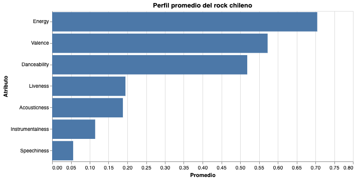
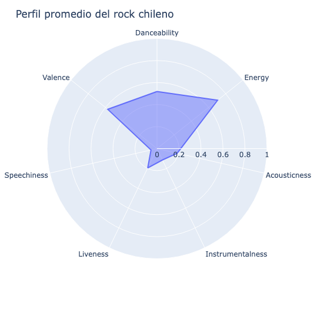

## ¿Cómo suena el rock chileno?

El rock chileno, desde sus inicios, es un género diverso. Desde Los Prisioneros, Los Jaivas o Los Bunkers parece haber un mar de diferencia. Sin embargo, si analizamos las 250 mejores canciones chilenas del género, pensado en su sentido más amplio, comienzan a aparecer patrones. Esto a partir de sus características sonoras medibles. 

Estas variables son atributos musicales desarrolladas por Spotify para describir técnicamente cómo suena una canción. Estas son: 

* Danceability: mide qué tan bailable es una canción considerando elementos como ritmo, estabilidad y regularidad. Mientras más cercano a 1, más apta es para bailar.
* Energy: el nivel de intensidad y actividad de una canción. Valores altos suelen asociarse a canciones rápidas, fuertes y dinámicas.
* Key: identifica la tonalidad principal de la canción.
* Loudness: el volumen general de la canción en decibeles (dB). Generalmente, canciones más intensas presentan valores más cercanos a 0.
* Mode: indica si la canción está en modo mayor o menor, asociado tradicionalmente a sensaciones más alegres o melancólicas.
* Speechiness: detecta la presencia de palabras habladas dentro de la canción. Valores altos indican mayor cercanía al habla o recitación.
* Acousticness: estima la probabilidad de que una canción sea acústica. Mientras más alto el valor, mayor presencia de instrumentos acústicos y menor producción amplificada.
* Instrumentalness: predice la probabilidad de que una canción no contenga voces. Valores altos indican canciones principalmente instrumentales.
* Liveness: detecta la presencia de público o grabaciones en vivo. Valores altos sugieren interpretaciones realizadas frente a la audiencia.
* Valence: la positividad emocional de una canción. Valores altos suelen asociarse a canciones alegres y optimistas, bajos reflejan lo más melancólico o tenso.
* Tempo: corresponde a la velocidad de la canción medida en BPM (beats per minute).
* Time Signature: indica la métrica o compás predominante de la canción.

Para nuestro análisis se priorizaron las variables Energy, Danceability, Valence, Acousticness, Instrumentalness, Liveness y Speechiness, ya que permiten representar de manera más clara y comparable el perfil sonoro promedio del rock chileno. Estas ya que comparten una misma escala de medición entre 0 y 1, lo que facilita su visualización. 

A partir de estos datos podemos construir un perfil de la canción de rock nacional. Las canciones comparten altos niveles de energía, bajos niveles de acousticness y speechiness, y valores medios en danceability y valence. Dicho de otra forma, las canciones del listado suelen ser intensas, principalmente eléctricas, poco habladas y moderadamente bailables. 

La variable con el promedio más alto es energy, cercana a 0.7 en una escala de 0 a 1. Esto indica que gran parte de las canciones emblemáticas dentro del género poseen niveles altos de intensidad sonora, asociados a guitarras eléctricas, baterías marcadas, etc.. En contraste, acousticness presenta valores bajos, lo que sugiere que predominan canciones poco acústicas y más cercanas a una producción amplificada.

Nuestra pregunta inicial era si se podía determinar una identidad sonora dentro del rock chileno. Los datos no entregan una respuesta 100%  absoluta, pero sí permiten afirmar que las canciones más representativas del género se acercan a un mismo perfil: energético, eléctrico, emocionalmente equilibrado y construido principalmente desde estructuras tradicionales del rock. La “canción promedio” del rock chileno funciona como una idea compartida entre distintas generaciones y estilos musicales.

## Visualización interactiva

[Ver visualización interactiva](visualizacion_1.html)

## Visualización interactiva

[Ver visualización interactiva](radar_chart.html)
