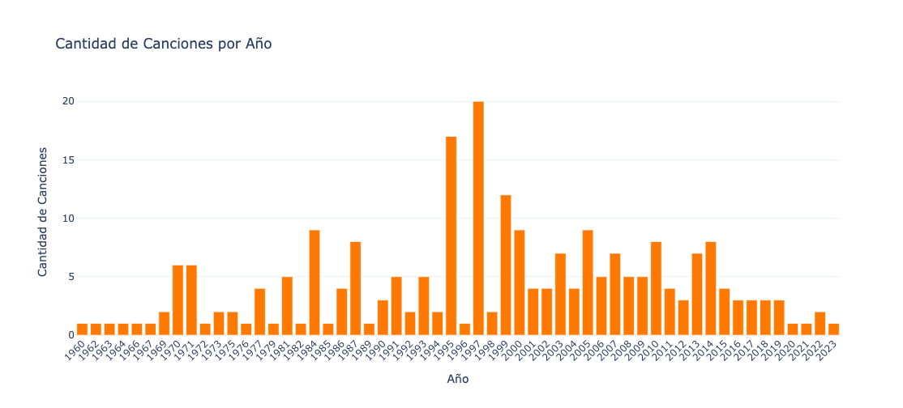
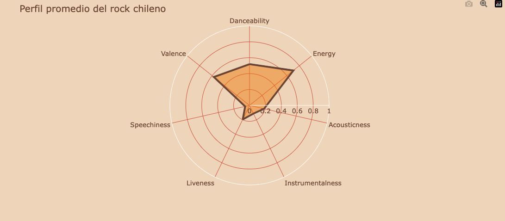
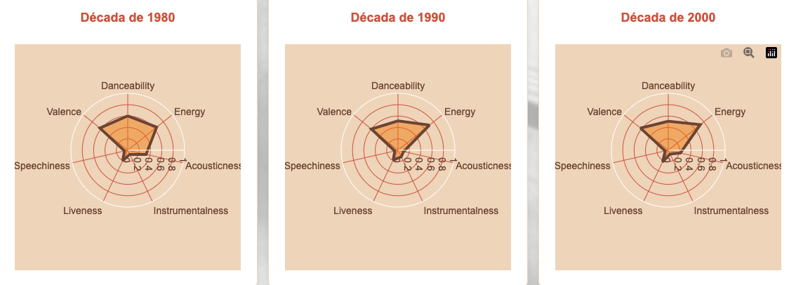

# Análisis de las visualizaciones 

Todas las visualizaciones fueron hechas en base a la base de datos única del trabajo : [Base de datos final (Excel)](Basededatosfinal.xlsx)
## Gráfico de barras 



## Radar general



Esta visualización muestra el **promedio de los atributos musicales** de las mejores canciones del rock chileno. A partir de estos promedios se construye el perfil sonoro promedio del género, evidenciando que las canciones comparten características similares, como altos niveles de Energy y bajos niveles de Speechiness y Acousticness, lo que respalda la hipótesis de una identidad sonora común.

**Codigo:** 
```import pandas as pd
import plotly.express as px

# Cargar la base de datos
df = pd.read_csv("mejorescancionesderock - Copia de mejorescancionesrocklatino_original.csv")

# Variables que vamos a usar para el radar
variables = [
    "Danceability",
    "Energy",
    "Acousticness",
    "Instrumentalness",
    "Liveness",
    "Speechiness",
    "Valence"
]

# Calcular promedios generales
promedios = df[variables].mean()

# Crear radar chart
fig = px.line_polar(
    r=promedios.values,
    theta=promedios.index,
    line_close=True
)

# Estilo del radar
fig.update_traces(
    fill="toself",
    line=dict(
        color="#654537",
        width=4
    ),
    fillcolor="rgba(227,122,53,0.45)"
)

# Estilo general
fig.update_layout(
    title="Perfil promedio del rock chileno",
    showlegend=False,
    paper_bgcolor="#ead3bc",
    plot_bgcolor="#ead3bc",
    font=dict(
        family="Arial",
        size=14,
        color="#654537"
    ),
    polar=dict(
        bgcolor="#ead3bc",
        radialaxis=dict(
            visible=True,
            range=[0, 1],
            gridcolor="#c15a49",
            linecolor="#c15a49"
        ),
        angularaxis=dict(
            gridcolor="#c15a49",
            linecolor="#c15a49"
        )
    )
)

fig.show()
```

## Radar por décadas



Esta visualización compara el **promedio de los atributos musicales** de las canciones publicadas en las décadas de 1980 (16 canciones), 1990 (61 canciones) y 2000 (49 canciones). El objetivo es observar cómo evoluciona el perfil sonoro del rock chileno a lo largo del tiempo. Aunque existen pequeñas variaciones entre décadas, los radares muestran una estructura muy similar, lo que refuerza la existencia de una identidad sonora compartida que se mantiene relativamente estable pese a los cambios generacionales y al contexto histórico.
