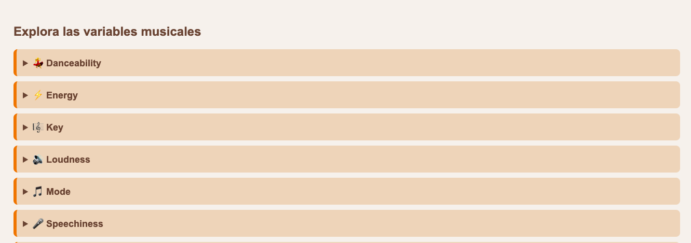
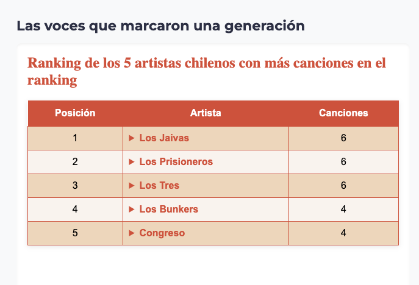
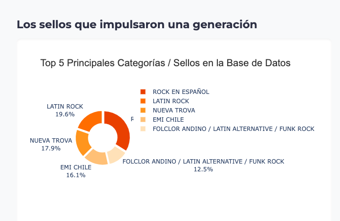

# Análisis de las visualizaciones 

Todas las visualizaciones fueron hechas en base a la base de datos única del trabajo : [Base de datos final (Excel)](Basededatosfinal.xlsx)
## Gráfico de barras 


Esta visualización muestra la cantidad de canciones del ranking según su año de publicación. Su objetivo es identificar los períodos de mayor producción e impacto del rock chileno, evidenciando el fuerte crecimiento durante la década de 1990, especialmente alrededor de 1997, y la disminución de su presencia en años más recientes. Esto permite relacionar la evolución del género con su contexto histórico y cultural.

**Código:**

## Radar general


Esta visualización muestra el **promedio de los atributos musicales** de las mejores canciones del rock chileno. A partir de estos promedios se construye el perfil sonoro promedio del género, evidenciando que las canciones comparten características similares, como altos niveles de Energy y bajos niveles de Speechiness y Acousticness, lo que respalda la hipótesis de una identidad sonora común.

**Código:** 
```import pandas as pd
import plotly.express as px

# Cargar la base de datos
df = pd.read_csv("mejorescancionesderock - Copia de mejorescancionesrocklatino_original.csv")

# Variables que vamos a usar para el radar
variables = [
    "Danceability",
    "Energy",
    "Acousticness",
    "Instrumentalness",
    "Liveness",
    "Speechiness",
    "Valence"
]

# Calcular promedios generales
promedios = df[variables].mean()

# Crear radar chart
fig = px.line_polar(
    r=promedios.values,
    theta=promedios.index,
    line_close=True
)

# Estilo del radar
fig.update_traces(
    fill="toself",
    line=dict(
        color="#654537",
        width=4
    ),
    fillcolor="rgba(227,122,53,0.45)"
)

# Estilo general
fig.update_layout(
    title="Perfil promedio del rock chileno",
    showlegend=False,
    paper_bgcolor="#ead3bc",
    plot_bgcolor="#ead3bc",
    font=dict(
        family="Arial",
        size=14,
        color="#654537"
    ),
    polar=dict(
        bgcolor="#ead3bc",
        radialaxis=dict(
            visible=True,
            range=[0, 1],
            gridcolor="#c15a49",
            linecolor="#c15a49"
        ),
        angularaxis=dict(
            gridcolor="#c15a49",
            linecolor="#c15a49"
        )
    )
)

fig.show()
```

## Radar por décadas


Esta visualización compara el **promedio de los atributos musicales** de las canciones publicadas en las décadas de 1980 (16 canciones), 1990 (61 canciones) y 2000 (49 canciones). El objetivo es observar cómo evoluciona el perfil sonoro del rock chileno a lo largo del tiempo. Aunque existen pequeñas variaciones entre décadas, los radares muestran una estructura muy similar, lo que refuerza la existencia de una identidad sonora compartida que se mantiene relativamente estable pese a los cambios generacionales y al contexto histórico.

**Código** (es el mismo usado para las tres decadas, solo cambiando los años)
```
import pandas as pd
import plotly.express as px

# Cargar la base de datos
df = pd.read_csv("mejorescancionesrocklatino_original.csv")

# Convertir fecha
df["Release Date"] = pd.to_datetime(df["Release Date"], format="mixed")

# Crear columna año
df["Year"] = df["Release Date"].dt.year

# Filtrar solo canciones de los 2000
df2000 = df[(df["Year"] >= 2000) & (df["Year"] <= 2009)]

# Variables para el radar
variables = [
    "Danceability",
    "Energy",
    "Acousticness",
    "Instrumentalness",
    "Liveness",
    "Speechiness",
    "Valence"
]

# Calcular promedios
promedios2000 = df2000[variables].mean()

# Mostrar los promedios
print(promedios2000)

# Crear radar
fig = px.line_polar(
    r=promedios2000.values,
    theta=promedios2000.index,
    line_close=True
)

fig.update_traces(
    fill='toself',
    line=dict(
        color='#654537',
        width=4
    ),
    fillcolor='rgba(227,122,53,0.45)'
)

fig.update_layout(
    showlegend=False,
    paper_bgcolor='#ead3bc',
    plot_bgcolor='#ead3bc',
    font=dict(
        family="Arial",
        size=14,
        color='#654537'
    ),
    polar=dict(
        bgcolor='#ead3bc',
        radialaxis=dict(
            visible=True,
            range=[0,1],
            gridcolor='#c15a49'
        ),
        angularaxis=dict(
            gridcolor='#c15a49'
        )
    )
)

fig.show()
```
## Tabla de atributos musicales



Esta visualización presenta las 12 variables musicales utilizadas en el análisis de las canciones del rock chileno. Su objetivo es explicar de manera clara qué mide cada atributo obtenido desde Spotify y cómo estos permiten describir técnicamente el sonido de una canción. De esta forma, el lector comprende las dimensiones utilizadas en las visualizaciones posteriores y el fundamento del análisis realizado.

**Código**
```
from IPython.display import HTML

HTML("""
<style>
.variables{
    max-width:700px;
    margin:auto;
    font-family: Arial, sans-serif;
}

details{
    background:#ead3bc;
    border-left:6px solid #e37a35;
    margin:10px 0;
    padding:12px;
    border-radius:8px;
}

summary{
    font-weight:bold;
    color:#654537;
    cursor:pointer;
    font-size:18px;
}

details p{
    color:#654537;
    margin-top:10px;
    line-height:1.6;
}
</style>

<div class="variables">

<h2 style="color:#654537;">Explora las variables musicales</h2>

<details>
  <summary>⚡ Energy</summary>
  <p>
    Mide la intensidad y actividad de una canción. Valores altos suelen asociarse a canciones rápidas, fuertes y dinámicas.
  </p>
</details>

<details>
  <summary>💃 Danceability</summary>
  <p>
    Indica qué tan adecuada es una canción para bailar considerando ritmo, estabilidad y regularidad.
  </p>
</details>

<details>
  <summary>🎸 Acousticness</summary>
  <p>
    Estima la probabilidad de que una canción sea acústica. Valores altos indican mayor presencia de instrumentos acústicos.
  </p>
</details>

<details>
  <summary>😊 Valence</summary>
  <p>
    Mide la positividad emocional de una canción. Valores altos suelen asociarse a canciones alegres y optimistas.
  </p>
</details>

<details>
  <summary>🎤 Speechiness</summary>
  <p>
    Detecta la presencia de palabras habladas dentro de una canción.
  </p>
</details>

<details>
  <summary>🎶 Instrumentalness</summary>
  <p>
    Predice la probabilidad de que una canción no contenga voces.
  </p>
</details>

<details>
  <summary>🎸 Liveness</summary>
  <p>
    Detecta la presencia de público o grabaciones en vivo.
  </p>
</details>

</div>
""")
```

## Tabla de artistas más presentes



Esta visualización muestra los cinco artistas con mayor cantidad de canciones dentro de la base de datos. Su objetivo es identificar qué bandas han tenido una mayor presencia en la selección y evidenciar cuáles han contribuido con más obras a la construcción del canon del rock chileno.

**Código** 
```
import pandas as pd
from IPython.display import HTML, display

# Ranking de artistas chilenos con más canciones
datos = {
    "Artista": [
        "Los Jaivas",
        "Los Prisioneros",
        "Los Tres",
        "Los Bunkers",
        "Congreso"
    ],
    "Canciones en el ranking": [6, 6, 6, 4, 4],
    "Canciones": [
        [
            "Todos Juntos - 2020 Remasterizado",
            "La Poderosa Muerte",
            "Mira Niñita - 2020 Remasterizado",
            "La Conquistada",
            "Hijos de la Tierra",
            "Sube a Nacer Conmigo Hermano"
        ],
        [
            "El Baile De Los Que Sobran",
            "La Voz de los '80",
            "Muevan Las Industrias",
            "Tren Al Sur",
            "Estrechez De Corazón",
            "We Are Sudamerican Rockers"
        ],
        [
            "Déjate Caer",
            "Un Amor Violento",
            "He Barrido el Sol",
            "Bolsa de Mareo",
            "Pájaros de fuego",
            "No Sabes Que Desperdicio Tengo en el Alma"
        ],
        [
            "Miño",
            "Bailando Solo",
            "Canción para mañana",
            "Llueve Sobre La Ciudad"
        ],
        [
            "En Todas las Esquinas",
            "Hijo Del Sol Luminoso",
            "El Cielito De Mi Pieza",
            "Premio de Consuelo"
        ]
    ]
}

df = pd.DataFrame(datos)

# Start building the HTML string, including the style block
html_output = """
<style>
table {
    border-collapse: collapse;
    width: 100%;
    font-family: Arial, sans-serif;
    box-shadow: 0 2px 8px rgba(0,0,0,0.1);
}
th {
    background-color: #c05a48;
    color: white;
    padding: 12px;
    text-align: center;
}
td {
    border: 1px solid #c05a48;
    padding: 10px;
}
tr:nth-child(even) {
    background-color: #ead5be;
}
tr:nth-child(odd) {
    background-color: #f8f3ee;
}
details summary {
    cursor: pointer;
    color: #c05a48;
    font-weight: bold;
}
details summary:hover {
    color: #9f4738;
}
h2 {
    color: #c05a48;
}
</style>

<h2>Ranking de los 5 artistas chilenos con más canciones en el ranking</h2>

<table>
<tr>
    <th>Posición</th>
    <th>Artista</th>
    <th>Canciones en el ranking</th>
</tr>
"""

# Loop through the DataFrame to generate table rows and append to the html_output string
for i, row in df.iterrows():
    canciones = "".join(
        [f"<li>{c}</li>" for c in row["Canciones"]]
    )

    html_output += f"""
    <tr>
        <td align='center'>{i+1}</td>
        <td>
            <details>
                <summary><b>{row['Artista']}</b></summary>
                <ul>
                    {canciones}
                </ul>
            </details>
        </td>
        <td align='center'>{row['Canciones en el ranking']}</td>
    </tr>
    """

html_output += "</table>"

display(HTML(html_output))
```
## Gráfico de discográficas



Este gráfico muestra los cinco principales sellos musicales presentes en la base de datos. Su objetivo es identificar cuáles han concentrado una mayor cantidad de canciones dentro del ranking y comprender qué sellos o categorías tuvieron una mayor participación en la difusión y consolidación del rock chileno. 

**Código:**

# Ficha técnica de la base de datos

### Características de los datos

- Base de datos en formato **CSV**.
- Contiene información de **232 canciones** pertenecientes al listado de las mejores canciones del rock chileno.
- Reúne información descriptiva de cada canción y atributos musicales obtenidos desde Spotify.

### Variables incorporadas

| Variable | Descripción |
|----------|-------------|
| Track URI | Identificador único de la canción en Spotify. |
| Track Name | Nombre de la canción. |
| Album Name | Nombre del álbum al que pertenece. |
| Artist Name(s) | Artista o banda intérprete. |
| Release Date | Fecha de lanzamiento de la canción. |
| Duration (ms) | Duración de la canción en milisegundos. |
| Popularity | Índice de popularidad otorgado por Spotify. |
| Explicit | Indica si la canción posee contenido explícito. |
| Added By | Usuario que agregó la canción a la base. |
| Added At | Fecha en que la canción fue incorporada. |
| Genres | Género(s) musical(es). |
| Record Label | Sello discográfico o categoría asociada. |
| Danceability | Qué tan bailable es la canción (0-1). |
| Energy | Nivel de intensidad y actividad (0-1). |
| Key | Tonalidad musical. |
| Loudness | Volumen promedio de la canción en decibeles (dB). |
| Mode | Modo musical (mayor o menor). |
| Speechiness | Presencia de palabras habladas (0-1). |
| Acousticness | Probabilidad de que la canción sea acústica (0-1). |
| Instrumentalness | Probabilidad de que la canción no contenga voces (0-1). |
| Liveness | Probabilidad de que la grabación sea en vivo (0-1). |
| Valence | Positividad emocional de la canción (0-1). |
| Tempo | Velocidad de la canción en BPM. |
| Time Signature | Compás predominante de la canción. |

### Observaciones

- Para las visualizaciones se utilizaron únicamente las variables necesarias según cada análisis.
- El análisis del perfil sonoro se realizó utilizando las variables **Danceability, Energy, Acousticness, Instrumentalness, Liveness, Speechiness y Valence**, ya que comparten una escala entre 0 y 1 y permiten comparar las canciones de forma consistente.
- La variable **Release Date** fue procesada para obtener el año de publicación y realizar comparaciones entre décadas.
```
